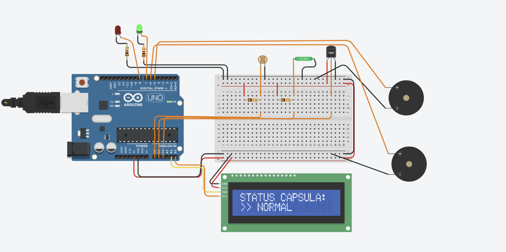
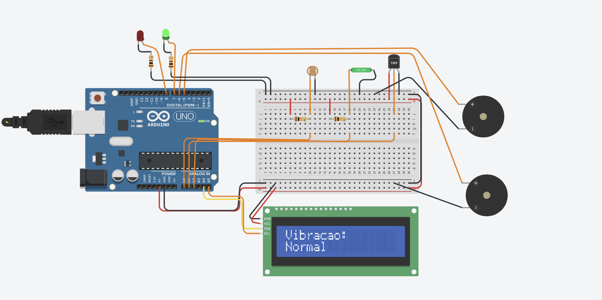
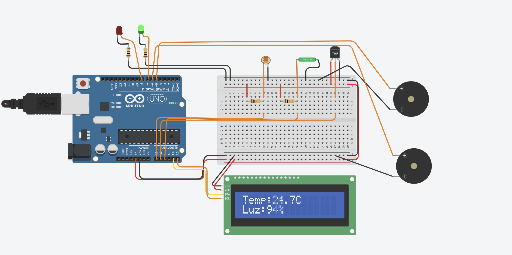

# Sistema IoT para Monitoramento de Cápsula Espacial

*Global Solution 2026 = Computer Organization and Architecture*       
*Ciência da Computação - 1CCPO*       

## Integrantes    
* Ana Julia Yumi Inoue - RM: 569430
* João Pedro Santos Ferreira - RM: 569202    
* Maria Fernanda Dias Ribeiro - RM: 569999

## Sobre o Sistema IoT  
O sistema simula o monitoramento de uma cápsula espacial usando um Arduino Uno.        
Três sensores coletam dados em tempo real: um TMP36 mede a temperatura interna, um LDR monitora a luminosidade e um sensor analógico detecta vibrações/impactos.          
Com base nas leituras, o sistema classifica o estado da cápsula em:      
* NORMAL;     
* ALERTA;     
* CRÍTICO       

Dessa forma, acionando LEDs e buzzers com frequências distintas para cada tipo de ocorrência.       
As informações são exibidas em um display LCD 16x2 com I2C, alternando entre três telas: temperatura/luminosidade, status de vibração e status geral da cápsula. 

## Demonstração do Sistema

**Sistema em Normalidade**           

*-> status*             
     

*-> vibração*        
      

*-> luz e temperatura*         
     

**Sistema em Alerta**          

*-> status* 
              

*-> vibração*            
          

*-> luz e temperatura*                  
   

